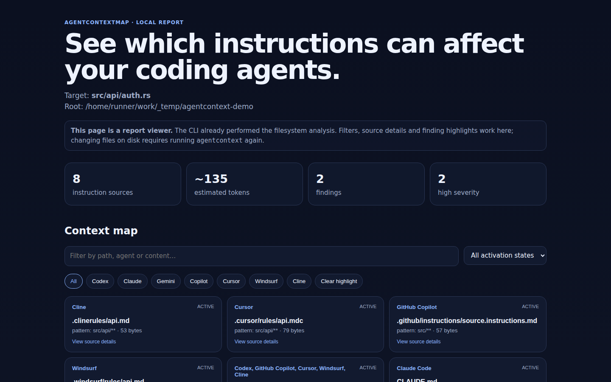

# AgentContextMap

[](https://github.com/BLCCoreStudio/AgentContextMap/actions/workflows/ci.yml)
[](https://github.com/BLCCoreStudio/AgentContextMap/actions/workflows/action-smoke.yml)
[](https://github.com/BLCCoreStudio/AgentContextMap/releases)
[](LICENSE)
[](Cargo.toml)

**Map which repository instructions can affect your coding agents.**

AgentContextMap is a local, read-only tool for mapping repository instruction files across Codex, Claude Code, Gemini CLI, GitHub Copilot, Cursor, Windsurf, and Cline. Give it a repository — and optionally a target file — to see the relevant instruction sources, activation state, obvious conflicts, approximate context size, and a self-contained HTML report.

<p align="center">
  <a href="docs/assets/report-details.png">
    
  </a>
</p>

> **Status:** early alpha. Agent behavior changes quickly, so support is deliberately conservative and tied to documented vendor behavior. See [`docs/SEMANTICS.md`](docs/SEMANTICS.md) for the verification matrix and known limits.

## Use it

| GitHub Actions | Local CLI |
| --- | --- |
| Inspect repository instruction sources during CI and optionally fail on high-confidence active conflicts. | Inspect locally, emit terminal/JSON output, or generate a self-contained interactive HTML report. |
| Linux x86_64 runner | Linux x86_64 standalone binary; source builds may work elsewhere |

### GitHub Actions — early-alpha integration

The Action is available from the repository development line. Until a versioned Action release is cut, `@main` is intended for evaluation; pin a full commit SHA for trusted production workflows.

```yaml
name: Agent instruction check

on:
  pull_request:

permissions:
  contents: read

jobs:
  agent-context:
    runs-on: ubuntu-latest
    steps:
      - uses: actions/checkout@v5

      - name: Inspect coding-agent instructions
        uses: BLCCoreStudio/AgentContextMap@main
        with:
          path: .
          format: terminal
```

Start report-only. When you want a CI gate for high-confidence active conflicts:

```yaml
      - name: Enforce active instruction conflicts
        uses: BLCCoreStudio/AgentContextMap@main
        with:
          path: .
          target: src/api/auth.rs
          fail-on-conflict: "true"
```

The composite Action downloads the published `v0.1.0-alpha.2` Linux binary and verifies its fixed SHA-256 digest before execution. The requested repository path must remain inside `GITHUB_WORKSPACE`.

### Linux x86_64 — download one file and run

No Rust toolchain and no archive extraction are required.

**[Download `agentcontext-linux-x86_64` from v0.1.0-alpha.2](https://github.com/BLCCoreStudio/AgentContextMap/releases/download/v0.1.0-alpha.2/agentcontext-linux-x86_64)**

Then:

```bash
chmod +x agentcontext-linux-x86_64
./agentcontext-linux-x86_64 --help
./agentcontext-linux-x86_64 .
```

Inspect one target path and generate the interactive report:

```bash
./agentcontext-linux-x86_64 . \
  --target src/api/auth.rs \
  --html report.html
```

Or download it from the [Releases page](https://github.com/BLCCoreStudio/AgentContextMap/releases). Each standalone binary has a matching `.sha256` file. A tar.gz package is also published for users who prefer an archive.

### Build from source

Requires Rust 1.74+.

```bash
cargo install --git https://github.com/BLCCoreStudio/AgentContextMap --bin agentcontext
```

## What it helps you inspect

A modern repository can contain several instruction systems at once:

- `AGENTS.md` and Codex `AGENTS.override.md`
- `CLAUDE.md`
- `GEMINI.md`
- `.github/copilot-instructions.md`
- `.github/instructions/**/*.instructions.md`
- `.cursor/rules/**/*.mdc`
- `.windsurf/rules/**/*.md`
- `.clinerules/**/*.md` / `*.txt`

Once these become nested, path-specific, model-decided, or manual, a simple question becomes surprisingly hard:

**Which instructions can affect this file, and which ones are definitely active versus merely conditional?**

AgentContextMap answers that without calling an LLM, executing repository instructions, or sending repository content to a remote service.

Generate a local HTML report:

```bash
agentcontext . --target src/api/auth.rs --html report.html
```

The HTML is an **interactive viewer for the analysis already performed by the CLI**. You can filter by agent and activation state, search sources, expand the exact instruction text, and highlight sources involved in findings. It does not silently rescan your filesystem from the browser; rerun the CLI after repository files change.

Machine-readable output:

```bash
agentcontext . --json
```

Fail CI only on high-confidence conflicts that are definitely active for the requested target:

```bash
agentcontext . --target src/api/auth.rs --json --fail-on-conflict
```

## What alpha.2 models

| Capability | Support |
| --- | --- |
| Nested `AGENTS.md` across documented agent ecosystems | Yes |
| Codex `AGENTS.override.md` | Yes |
| Hierarchical `CLAUDE.md` and repository-contained `@` imports | Yes |
| Hierarchical `GEMINI.md` and repository-contained `@` imports | Yes |
| Copilot repo-wide + recursive path-specific instructions | Yes |
| Cursor `.mdc` rules with always/glob/model/manual activation | Yes |
| Windsurf `.windsurf/rules/*.md` activation modes | Yes |
| Cline `.clinerules/` plus `paths` conditions | Yes |
| Correct `*` vs `**`, brace and basic character-class glob matching | Yes |
| Agent-aware conflict detection | Yes |
| Active vs path-specific vs conditional vs manual status | Yes |
| Missing repository import findings | Yes |
| JSON output | Yes |
| Interactive self-contained HTML viewer | Yes |
| Executes instructions, tools, prompts, scripts, or MCP servers | **No** |
| Reads imports outside the scanned repository | **No** |
| Sends repository content to a remote service | **No** |

## Example

```text
AgentContextMap
===============
Root: /work/acme
Target: src/api/auth.rs
Sources: 5 | Approx. tokens: 812 | Findings: 1

Instruction sources
-------------------
1. AGENTS.md
   Agents: Codex, GitHub Copilot, Cursor, Windsurf, Cline
   Status: active | Scope: workspace tree
2. src/api/AGENTS.md
   Agents: Codex, GitHub Copilot, Cursor, Windsurf, Cline
   Status: active | Scope: src/api subtree

Findings
--------
CONFLICT [high] AGENTS.md <-> src/api/AGENTS.md
  Overlapping sources contain directives with opposite polarity.
```

## Correctness model

AgentContextMap does **not** pretend every coding agent has identical semantics.

The scanner keeps source ownership and activation explicit. A manual Windsurf rule is not labeled active. A Cursor model-decided rule is not treated as certain. A conflict between Claude-only and Gemini-only files is not reported as if one agent saw both. Path-specific rules are evaluated against the supplied target.

For the exact vendor documentation used to implement these decisions, read [`docs/SEMANTICS.md`](docs/SEMANTICS.md).

## Designed for inspection, not execution

AgentContextMap reads instruction text but never follows it. It does not run commands found in repository instructions, start agent skills, contact MCP servers, or call an AI API.

Claude/Gemini relative imports are followed only when they remain inside the scanned repository. Absolute, home-directory, or escaping imports are intentionally not read.

## CLI

```text
agentcontext [ROOT] [OPTIONS]

--target <PATH>        Show sources that can affect a target path
--json                 Emit machine-readable JSON
--html <PATH>          Write a self-contained interactive report viewer
--fail-on-conflict     Exit with code 2 on a high-severity active conflict
-h, --help             Print help
-V, --version          Print version
```

Exit codes:

- `0`: analysis completed and no configured failure condition was hit
- `1`: invalid arguments or I/O failure
- `2`: a high-severity conflict was found with `--fail-on-conflict`

## Known limits

This is not runtime instrumentation. User/global/org instruction sources outside the repository are not scanned, model-decided rules cannot be proven active from files alone, and deterministic natural-language conflict detection cannot understand every possible contradiction.

Those limits are documented rather than hidden. See [`docs/SEMANTICS.md`](docs/SEMANTICS.md).

## Roadmap

Near-term work is focused on correctness rather than adding every format possible:

1. vendor-specific precedence visualizations;
2. broader real-repository compatibility fixtures;
3. richer conflict classes with measured false-positive rates;
4. per-agent context-budget breakdown;
5. SARIF / GitHub code-scanning output;
6. a versioned GitHub Action release, signed releases, and easier package-manager installs.

## Contributing and support

Bug reports and small, well-scoped pull requests are welcome. For scope/precedence bugs, include the agent product, version if known, a minimal repository layout, and a documentation link or reproducible observation.

See [`CONTRIBUTING.md`](CONTRIBUTING.md), [`SUPPORT.md`](SUPPORT.md), and [`SECURITY.md`](SECURITY.md).

## License

MIT
